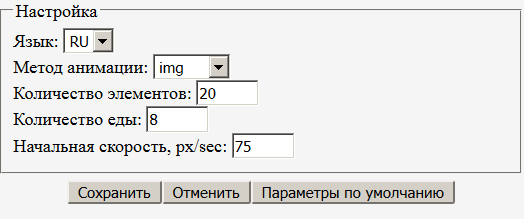

# jsSnake
Game application on js to demonstrate the use of animation when drawing graphics in different ways. The application supports mobile devices.

Игровое приложение на js для демонстрации использования анимации при рисовании графики разными способами. Приложение поддерживает мобильные устройства.

## Описание

Анимация построена с использованием стандарта [Animation timing](https://www.w3.org/TR/animation-timing/) (`requestAnimationFrame`). Отрисовка изображения может выполняться различными способами (метод анимации задается в параметрах настройки):
 - `` - элементы змейки –  картинки движутся в блоке `
`. 
 - `js` - элементы змейки – блоки `
` движутся в блоке `
`. 
 - ` canvas` - элементы змейки – квадраты `fillRect` движутся по канве.  
Размер элемента змейки рассчитывается исходя  из заданного в параметрах настройки количества элементов, которое может разместиться на видимой ширине или высоте области окна браузера (берется минимальная величина).  
Вычисление координат элементов змейки в зависимости от времени и логика игры реализованы  в функции ` model`.  
Управление движением осуществляется клавишами управления курсором или кликом мыши (в мобильных устройствах прикосновением к экрану).  
Форму параметров настройки можно вызвать по `F4` или из формы, которая вызывается по правой кнопке мыши (в мобильных устройствах по длительному касанию экрана).  
  
[Запустить программу.](http://sergechurkin.vacau.com/snake.html)

